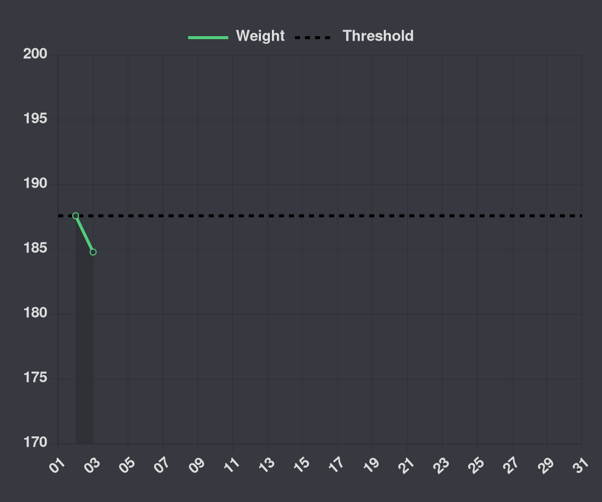

# Ruby Discord Bot
Welcome to the Ruby Discord Bot repository! This Discord bot communicates with the [Ruby server](https://github.com/SelfDotUser/Ruby-Server) 
to give you graphs of your weight journey.
 
You can use the Ruby bot in the [Ruby Discord server](https://discord.gg/XwAD5nSnum). If you ask the developer, the Ruby bot can be added to your server.

# Authentication
The Ruby server authenticates users using basic HTTP authentication. So, when you use `/progress` and `/record`, it asks you for a passcode. 
You must enter the passcode to use these features.

The Ruby bot will assign you a passcode if you’re a new user using `/new`. Treat this passcode as a password.

# Features
- `/progress [passcode]` - Returns a graph of your current month's progress
- `record [weight] [passcode]` - Updates your weight data and returns a graph of your current month's progress
- `/new` - Creates a new user using your Discord user id as your username and an auto-generated passcode as your password

# Example

`/progress [passcode]` returns: 

